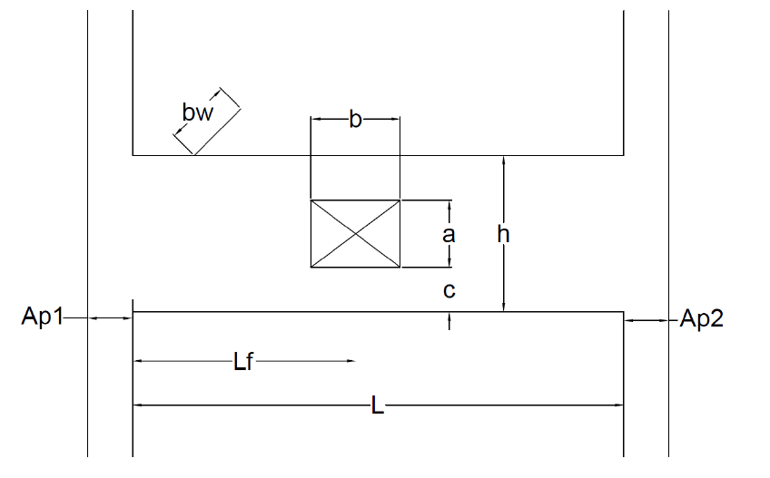
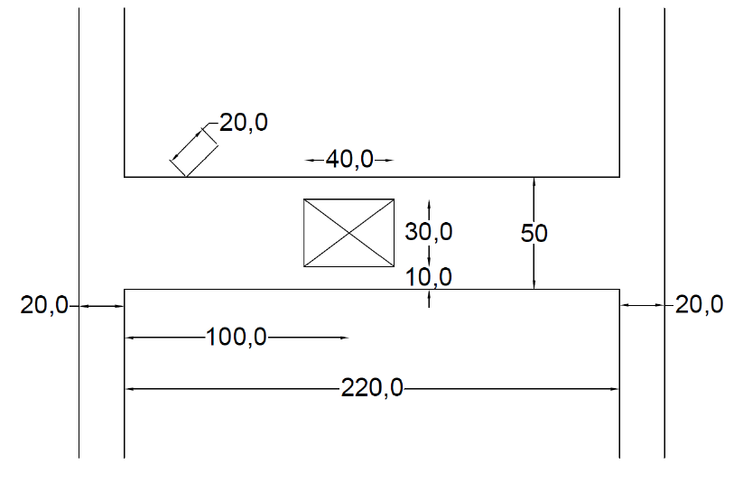

# Descrição do Modelo

## 1. Descrição das variáveis geométricas

Abaixo segue a representação da geometria do problema:

---

## 2. Descrição dos valores usados no exemplo 1 do modelo

Abaixo segue os valores adotados para esse modelo:

---
